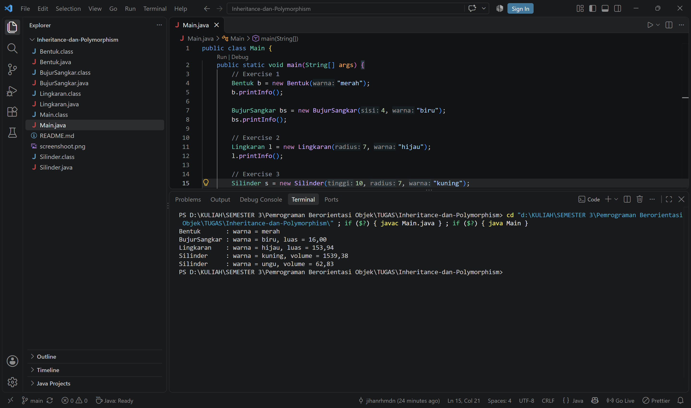

# Inheritance dan Polymorphism

Latihan Pemrograman Berorientasi Objek (Java) tentang **abstraction, encapsulation, inheritance, dan polymorphism**.
Program ini membuat hierarki kelas bangun datar dan bangun ruang sederhana.

## Struktur Kelas

```
Bentuk
├── BujurSangkar
└── Lingkaran
    └── Silinder
```

| Kelas | Induk | Atribut | Method |
|-------|-------|---------|--------|
| `Bentuk` | - | `warna` (protected) | `getWarna()`, `setWarna()`, `printInfo()` |
| `BujurSangkar` | `Bentuk` | `sisi` (private) | `getSisi()`, `setSisi()`, `hitungLuas()`, `printInfo()` |
| `Lingkaran` | `Bentuk` | `radius` (private), `PHI` (static final) | `getRadius()`, `setRadius()`, `hitungLuas()`, `printInfo()` |
| `Silinder` | `Lingkaran` | `tinggi` (private) | `getTinggi()`, `setTinggi()`, `hitungVolume()`, `printInfo()` |

## Isi Folder

| File | Keterangan |
|------|------------|
| `Bentuk.java` | Exercise 1: kelas induk |
| `BujurSangkar.java` | Exercise 1: turunan `Bentuk` |
| `Lingkaran.java` | Exercise 2: turunan `Bentuk` |
| `Silinder.java` | Exercise 3: turunan `Lingkaran` |
| `Main.java` | Program utama untuk menguji semua kelas |

## Cara Menjalankan

Pastikan JDK sudah terpasang (cek dengan `javac -version`).

```bash
javac *.java
java Main
```

## Contoh Output

```
Bentuk       : warna = merah
BujurSangkar : warna = biru, luas = 16.00
Lingkaran    : warna = hijau, luas = 153.94
Silinder     : warna = kuning, volume = 1539.38
Silinder     : warna = ungu, volume = 62.83
```

## Screenshot Hasil Program



## Penerapan Konsep PBO pada Kode

### 1. Encapsulation

Atribut dibuat `private` sehingga tidak bisa diubah langsung dari luar kelas. Akses dilakukan lewat getter dan setter.

Contoh di `Lingkaran.java`:

```java
private double radius;

public double getRadius() {
    return radius;
}

public void setRadius(double r) {
    this.radius = r;
}
```

| Kelas | Atribut | Modifier | Akses lewat |
|-------|---------|----------|-------------|
| `Bentuk` | `warna` | `protected` | `getWarna()`, `setWarna()` |
| `BujurSangkar` | `sisi` | `private` | `getSisi()`, `setSisi()` |
| `Lingkaran` | `radius` | `private` | `getRadius()`, `setRadius()` |
| `Silinder` | `tinggi` | `private` | `getTinggi()`, `setTinggi()` |

`Main.java` memakai setter ini, misalnya `s.setTinggi(5)`, `s.setRadius(2)`, dan `s.setWarna("ungu")`.

### 2. Inheritance

Subclass mewarisi atribut dan method dari superclass memakai `extends`, dan memanggil constructor induk lewat `super(...)`.

```java
public class Lingkaran extends Bentuk {
    public Lingkaran(double radius, String warna) {
        super(warna);          // mengisi warna milik Bentuk
        this.radius = radius;
    }
}

public class Silinder extends Lingkaran {
    public double hitungVolume() {
        return hitungLuas() * tinggi;   // hitungLuas() diwarisi dari Lingkaran
    }
}
```

- `BujurSangkar` dan `Lingkaran` mewarisi `Bentuk` (atribut `warna`, `getWarna()`, `setWarna()`).
- `Silinder` mewarisi `Lingkaran`, sehingga ikut mewarisi `radius`, `hitungLuas()`, dan `warna`.

### 3. Polymorphism

Setiap subclass menimpa (`@Override`) method `printInfo()` dari `Bentuk`. Nama method sama, tetapi perilakunya berbeda tergantung kelasnya.

```java
// Bentuk.java
public void printInfo() { ... }

// Silinder.java
@Override
public void printInfo() {
    System.out.printf("%-13s: warna = %s, volume = %.2f%n", "Silinder", warna, hitungVolume());
}
```

Pemanggilan `printInfo()` pada objek `Bentuk`, `BujurSangkar`, `Lingkaran`, dan `Silinder` di `Main.java` menghasilkan tampilan yang berbeda-beda.

## Catatan

- Nilai `PHI` adalah `3.14159`, dideklarasikan sebagai konstanta kelas (`public static final`) di `Lingkaran`.
- Atribut `warna` dibuat `protected` agar bisa diakses subclass, namun tetap disediakan getter dan setter.