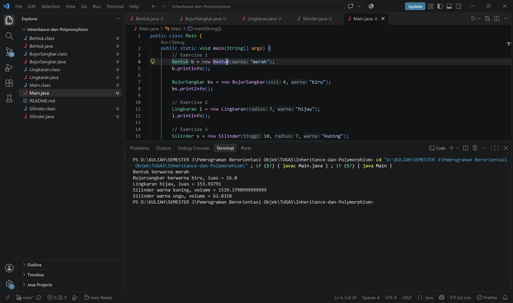

# Inheritance dan Polymorphism

Latihan Pemrograman Berorientasi Objek (Java) tentang **abstraction, encapsulation, inheritance, dan polymorphism**.
Program ini membuat hierarki kelas bangun datar dan bangun ruang sederhana.

## Struktur Kelas

```
Bentuk
├── BujurSangkar
└── Lingkaran
    └── Silinder
```

| Kelas | Induk | Atribut | Method |
|-------|-------|---------|--------|
| `Bentuk` | - | `warna` (protected) | `getWarna()`, `setWarna()`, `printInfo()` |
| `BujurSangkar` | `Bentuk` | `sisi` (private) | `getSisi()`, `setSisi()`, `hitungLuas()`, `printInfo()` |
| `Lingkaran` | `Bentuk` | `radius` (private), `PHI` (static final) | `getRadius()`, `setRadius()`, `hitungLuas()`, `printInfo()` |
| `Silinder` | `Lingkaran` | `tinggi` (private) | `getTinggi()`, `setTinggi()`, `hitungVolume()`, `printInfo()` |

## Isi Folder

| File | Keterangan |
|------|------------|
| `Bentuk.java` | Exercise 1: kelas induk |
| `BujurSangkar.java` | Exercise 1: turunan `Bentuk` |
| `Lingkaran.java` | Exercise 2: turunan `Bentuk` |
| `Silinder.java` | Exercise 3: turunan `Lingkaran` |
| `Main.java` | Program utama untuk menguji semua kelas |

## Cara Menjalankan

Pastikan JDK sudah terpasang (cek dengan `javac -version`).

```bash
javac *.java
java Main
```

## Contoh Output

```
Bentuk berwarna merah
Bujursangkar berwarna biru, luas = 16.0
Lingkaran hijau, luas = 153.93791
Silinder warna kuning, volume = 1539.3790999999999
Silinder warna ungu, volume = 62.8318
```

## Screenshot Hasil Program



## Format `printInfo()`

| Kelas | Format |
|-------|--------|
| `Bentuk` | `Bentuk berwarna [warna]` |
| `BujurSangkar` | `Bujursangkar berwarna [warna], luas = [luas]` |
| `Lingkaran` | `Lingkaran [warna], luas = [luas]` |
| `Silinder` | `Silinder warna [warna], volume = [volume]` |

## Konsep PBO yang Dipakai

- **Encapsulation**: atribut `sisi`, `radius`, dan `tinggi` bersifat `private` dan diakses lewat getter/setter.
- **Inheritance**: `BujurSangkar` dan `Lingkaran` mewarisi `Bentuk`, sedangkan `Silinder` mewarisi `Lingkaran`.
- **Polymorphism**: setiap subclass menimpa (`@Override`) method `printInfo()` dengan tampilan sendiri.
- **Constructor chaining**: constructor subclass memanggil `super(...)` di baris pertama untuk mengisi atribut milik induk.
- **Reuse kode**: `Silinder.hitungVolume()` memakai `hitungLuas()` dari `Lingkaran` (luas alas × tinggi).

## Catatan

- Nilai `PHI` adalah `3.14159`, dideklarasikan sebagai konstanta kelas (`public static final`) di `Lingkaran`.
- Atribut `warna` dibuat `protected` agar bisa diakses subclass, namun tetap disediakan getter dan setter.